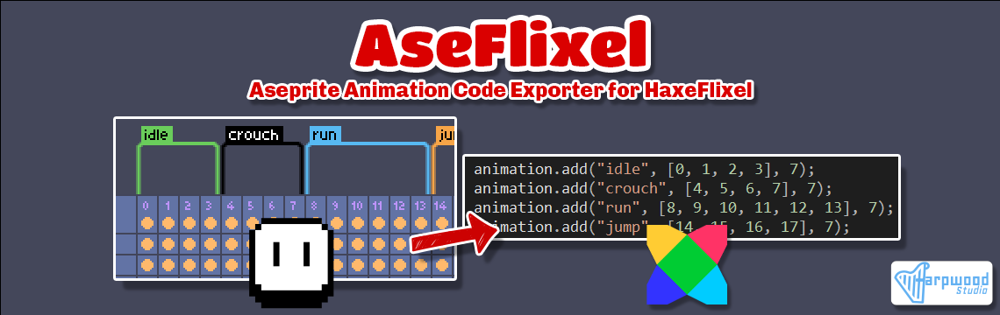

# 

AseFlixel is a robust Aseprite Animation Code Exporter tailored for HaxeFlixel. This script streamlines the animation code generation process by extracting animation data from Aseprite's timeline tags. With AseFlixel, effortlessly integrate animations into your HaxeFlixel projects, saving time and enhancing your game development workflow.

## Table of Contents

- [Features](#features)
- [Prerequisites](#prerequisites)
- [Installation](#installation)
- [Usage](#usage)
- [Dialog Options](#dialog-options)
- [Support this project](#support-this-project)
- [License](#license)

## Features

**AseFlixel** offers a range of convenient features to streamline your animation workflow:

- **Seamless Export**: Effortlessly export animation code from Aseprite to HaxeFlixel, reducing manual work and saving valuable development time.

- **Flexible Animation Properties**: Customize animation properties such as frame rate, animation direction, and more, ensuring your animations look and behave exactly as intended.

- **Consistent Naming Conventions**: AseFlixel supports custom animation prefixes and suffixes, allowing you to maintain consistent and organized animation naming conventions throughout your project.

- **Automated Animation Directions**: The script automatically handles animation directions (e.g., REVERSE, PING_PONG) based on Aseprite tags, streamlining the animation setup process.

- **Effortless Exporting**: Export animations directly from the Aseprite timeline; no manual code writing required. This seamless integration makes it easy to update and iterate on your animations while staying focused on the creative process.

- **Export Options**: Choose to export animations as plain code to a `.txt` file or as a complete Haxe class `.hx` file. The class export option automatically generates all the necessary boilerplate code, including the data from other options such as `Package Name`, `Class Name`, `Asset Folder`, and `Asset File Name`, for easy integration into your HaxeFlixel project.

**AseFlixel** empowers you to create dynamic and engaging animations for your HaxeFlixel projects without the hassle of manual code generation, allowing you to focus on bringing your game to life.

## Prerequisites

Before using AseFlixel, please ensure you have the following prerequisites installed on your system:

1. [Aseprite](https://www.aseprite.org/): AseFlixel is an Aseprite script, so you need to have Aseprite installed to run the script and export animations to HaxeFlixel. Aseprite 1.3 beta or newer is required.

2. [HaxeFlixel](https://haxeflixel.com/): You need to have HaxeFlixel installed in your development environment in order to use the generated animation code.

3. Some familiarity with the **Aseprite** and the **HaxeFlixel** game framework.

## Installation

Follow these simple steps to install **AseFlixel** and start using it in your **Aseprite**:

1. Download the latest version of AseFlixel from the [GitHub repository](https://github.com/yourusername/AseFlixel) or from the [itch.io page](https://harpwood.itch.io/aseflixel).
2. Extract the downloaded `AseFlixel.zip` file to retrieve the 'AseFlixel.lua' file.
3. In **Aseprite**, open the **Scripts** folder: `File` > `Scripts` > `Open Scripts Folder`.
4. Copy the downloaded `AseFlixel.lua` file into the **Scripts** folder.
5. Restart Aseprite to load **AseFlixel**, or use the **Scripts** menu to refresh the scripts for immediate availability.


## Usage

Follow these straightforward steps to use AseFlixel and export your Aseprite animation code to HaxeFlixel effortlessly:

1. Open your sprite in Aseprite.

2. Ensure that you have added tags to the sprite's timeline to represent animations. To add tags, right-click on frame numbers in the timeline and select the `New Tag` from the drop-down menu.

3. Run the **AseFlixel** script: `File` > `Scripts` > `AseFlixel`.

4. The **AseFlixel** dialog will open, presenting you with various customization options for the animation code generation.

5. Set your desired options in the AseFlixel dialog. You'll have the flexibility to choose from a range of customizable parameters, including animation direction, frame rate, custom animation prefixes, and more. We'll explore these options in more detail in the next section: [Dialog Options](#dialog-options).

6. After configuring the options, click on the **Save** button to generate and save the animation code.

That's it! With these simple steps, you can export your animations from Aseprite to HaxeFlixel without the need for manual code writing, saving time and effort in your game development process. Enjoy a seamless animation workflow with AseFlixel!

> Tip: You can create your custom shortcut to execute the AseFlixel, either by selecting `Edit` > `Keyboard Shortcuts` or by pressing `Ctrl+Alt+Shift+K`.


## Dialog Options

The **AseFlixel** dialog offers a range of options to customize the animation code generation. Let's explore each option in detail.

#### Save Animation Code to

Use this option to specify the file path where the generated code will be saved. You have the flexibility to choose the destination folder and file name. Avoid including any file extension, as the script will automatically add the appropriate extension (`.txt` or `.hx`) based on whether you are exporting a Haxe class or not.

If you leave the file path and file name fields empty, the script will use the same path and name as your Aseprite file and add the suitable extension (`.txt` or `.hx`) accordingly. In the case your Aseprite file is a new unsaved file, but it contains at least one tag, the generated code will be saved at the same folder with Aseprite's executable file and will get the default name that Aseprite assigns to new sprites, for example, `Sprite-0001`.

#### Default Frame Rate

This option allows you to set the default frame rate for animations. The specified frame rate will be used for animations that do not have a custom frame rate defined in their tag user data or when the `Frame Rate from Tag User Data` option is not checked.

#### Frame Rate from Tag User Data

When this option is checked, the script will use custom frame rates specified in each tag's user data. If a custom frame rate is found, it will override the default frame rate. However, the override will only occur if the user data contains valid numbers. If the user data is not a valid number, the default frame rate will be used instead. This feature allows you to fine-tune the frame rate for each animation individually, providing greater flexibility and control over your animations.

#### Include Tag Animation Direction

When this option is enabled, the script will include each tag's animation direction in the generated code. Aseprite's tag system offers four animation direction options:

- Forward
- Reverse
- Ping-pong
- Ping-pong reverse

Animations with specified directions will be created accordingly. However, if this option is disabled, all animations in the generated code will have the `Forward` direction, regardless of their animation direction data.

For example, let's consider a sprite with a tag named `idle` on frames 1-4. The generated code will look like this for each case:

```haxe
// Please note that the default frame counting in Aseprite starts from frame 1, 
// but in HaxeFlixel starts from 0
// That means, frames 1-4 in Aseprite are 0-3 in HaxeFlixel
animation.add("idle", [0, 1, 2, 3], 7);              // Forward Animation Direction
animation.add("idle", [3, 2, 1, 0], 7);              // Reverse Animation Direction
animation.add("idle", [0, 1, 2, 3, 2, 1], 7);      // Ping-pong Animation Direction
animation.add("idle", [3, 2, 1, 0, 1, 2], 7);      // Ping-pong reverse Animation Direction
```

#### Instance Name

You have the option to customize the instance name for the animation code. If left empty, no instance name will be applied. This feature is useful when you want to define sprite animations outside of its class.

Example:

```haxe
// Without instance name
animation.add("idle", [0, 1, 2, 3], 7);

// With instance name defined as `sprite`
sprite.animation.add("idle", [0, 1, 2, 3], 7);
```

By specifying an instance name, you can easily organize and access your  animations from different parts of your code. This enhances the  modularity and readability of your HaxeFlixel project in various  scenarios.

It is worth noting that if the `Export to Class` option is enabled, the `Instance Name` will be ignored, as animations will be defined within the class itself.

#### Custom Animation Prefix

You can enter a custom prefix to be added to the animation names. If left empty, no prefix will be applied. The custom prefix will be added before the animation tag name in the generated code.

Example:

```haxe
//  Without custom prefix
animation.add("idle", [0, 1, 2, 3], 7);

//  With custom prefix defined as 'player_'
animation.add("player_idle", [0, 1, 2, 3], 7);
```

#### Custom Animation Suffix

You have the option to enter a custom suffix to be added to the animation names. If left empty, no suffix will be applied. The custom suffix will be added after the animation tag name in the generated code.

Example:

```haxe
//  Without custom suffix 
animation.add("idle", [0, 1, 2, 3], 7);

//  With custom suffix defined as '_anim'
animation.add("idle_anim", [0, 1, 2, 3], 7);
```

Additionally, you can combine both a custom prefix and suffix for more flexibility:

```haxe
//  With custom prefix defined as 'player_' and custom suffix defined as '_anim'
animation.add("player_idle_anim", [0, 1, 2, 3], 7);
```

#### Export to Class

You can check this option to export the generated code to a Haxe class `.hx` file instead of a plain animation code in a `.txt` file. When enabled, the script will automatically generate all the necessary boilerplate code and add it to a Haxe class `.hx` file. This includes the data from the other options such as `Package Name`, `Class Name`, `Asset Folder`, and `Asset File Name`. 

If the `Export to Class` option is not enabled, all the aforementioned options will be ignored, and the script will generate the animation code as a plain `.txt` file without any additional class structure.

#### Package Name

If you choose to export the generated code to a Haxe class, you can specify the package name for the class file.

Example:

```haxe
// Generated code with no package name
package ;

// Generated code with `actors` package name
package actors;
```

#### Class Name

When exporting the generated code to a Haxe class, you have the option to specify the class name. It is important to note that the provided class name will be used as-is without any validation, so make sure it adheres to the Haxe class naming conventions. For example, it should not start with a number, and it should be a valid identifier.

If you choose not to provide a class name, the script will use the name of the sprite's file and convert its first letter to uppercase to create a class name. For example, if the Aseprite file name is `adventurer.aseprite`, the generated class name will be `Adventurer`.

#### Asset Folder

You can specify the asset folder where the sprite sheet is located within your project folders. By default, the script provides `assets` as the folder name for your convenience, but you are free to modify it according to your project structure and preferences.

Example:

```haxe
// Generated code with Asset Folder provided as `assets` (default)
loadGraphic("assets/... 

// Generated code with Asset Folder provided as `assets/actors`
loadGraphic("assets/actors/...
```


#### Asset File Name

Specify the asset file name (leave empty for a placeholder).

Example:

```haxe
// Generated code with the Asset File Name defined as `adventurer.png` (and default assets folder)
loadGraphic("assets/adventurer.png", true, 50, 37);

// Generated code with not defined Asset File Name (and default assets folder)
loadGraphic("assets/[YOUR_ASSET_FILE_NAME_HERE]", true, 50, 37);

```

It is worth noting that the `Animated:Bool` parameter of the `loadGraphic()` function will always be set to `true`, as animated sprites are expected in this context. Additionally, the `Width:Int` and `Height:Int` parameters will use the sprite's dimensions retrieved from Aseprite.

## Support AseFlixel

If you find this script valuable and would like to contribute to its development, there are several ways you can show your support:

- **Star the Repository:** Demonstrate your appreciation by giving the repository a star on GitHub. This action not only acknowledges the tool's usefulness but also encourages its continued growth and improvement.

- **Report Issues:** Encountered bugs, issues, or have feature requests? Feel free to create new issues on GitHub. Your feedback is essential and assists in refining the script's performance.

- **Contribute Code:** Developers are welcome to enhance the script's functionality by forking the repository, making improvements, and submitting pull requests.

- **Spread the Word:** Share this script with others who might benefit from its capabilities. The wider its reach, the more motivated I am to maintain and enhance it.

- **Buy Me a Coffee:** If you'd like to express your gratitude, you can [buy me a coffee](https://www.buymeacoffee.com/harpwood). Your contribution keeps me motivated to work on open-source projects like this.

- **Sponsor this Project:** By utilizing the 'Sponsor this project' button at the top of the repository page, you can make a small donation to support the project's development.

- **Support via itch.io:** You can demonstrate your appreciation by downloading from the [itch.io](https://harpwood.itch.io/aseflixel) page and contributing a modest donation when prompted.

Your support is genuinely valued! Thank you for utilizing **AseFlixel** and being a part of its vibrant community.

## License

This project is licensed under the [GNU General Public License (GPL-3.0)](https://www.gnu.org/licenses/gpl-3.0.en.html), which means you are free to use, modify, and distribute this script in accordance with the terms of the license. The GNU General Public License allows for flexibility and provides users with the freedom to utilize the script for both personal and commercial purposes.

The GNU General Public License is designed to promote software freedom and protect the rights of users. It ensures that the source code remains open and accessible to everyone, encouraging collaboration and community-driven development.

Please review the full text of the GNU General Public License in the [LICENSE](https://github.com/harpwood/AseFlixel/blob/main/LICENSE) file for more details on your rights and obligations.
